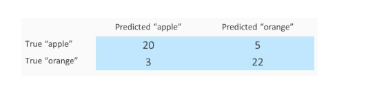
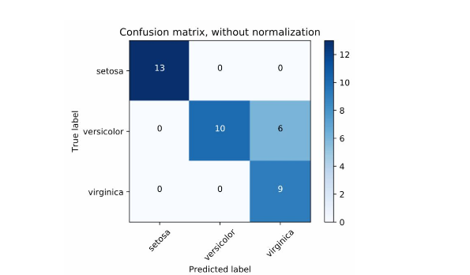
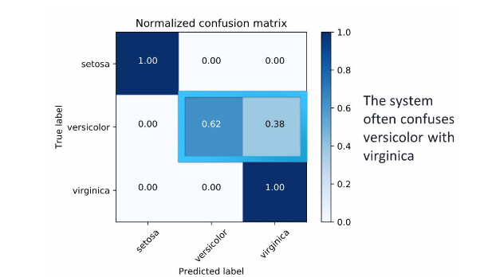
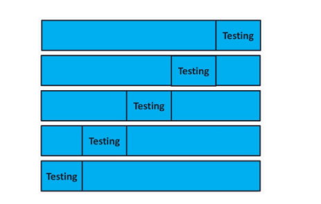
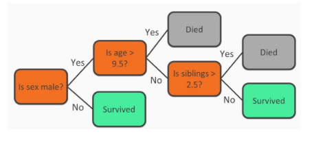
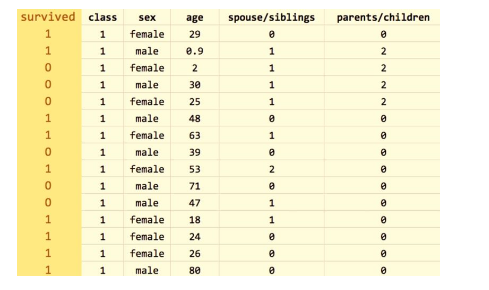
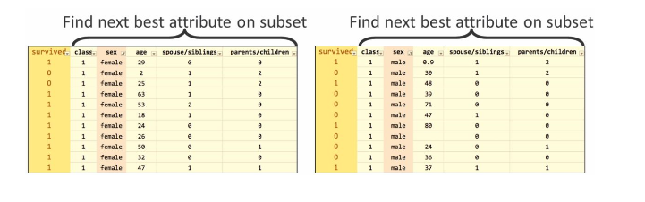
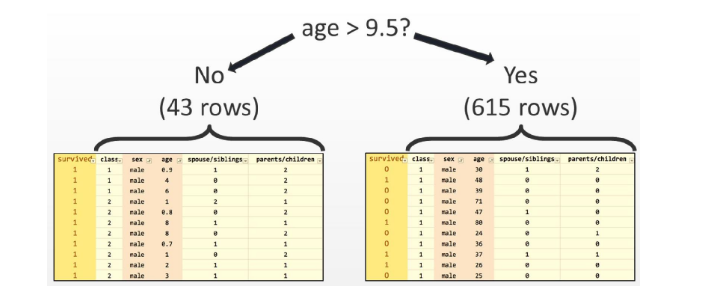

### Classification

##### -> AI provides us with various classification techniques, but machine learning classification would be the best to start with as it is the most common one.

##### -> Imagine that we have images of both apples and oranges, looking at which our application would help identify whether the image is of an apple or an orange. This type of classification can be termed as binary classification, which means classifying the objects of a given set into two groups, but techniques do exist for multiclass classification as well. We would require a large number of images of apples and oranges, and a machine learning algorithm that would be set in such a way that the application would be able to classify both image types. In other words, we make these algorithms learn the difference between the two objects to help classify all the examples correctly. This is known as supervised learning.

##### -> The result would be a model that can be deployed in an application, and it would function as seen in the following diagram. The application would memorize facts about the distinction between apples and oranges and recognize actual images using a machine learning algorithm.

### Evaluation Overview

##### -> We can evaluate how well the model is working by measuring its accuracy. Accuracy would be defined as the percentage of cases that are classified correctly. We can analyze the mistakes made by the model, or its level of confusion, using a confusion matrix. Let's take a look at the following binary classification example, which shows the number of times that the model has made the correct predictions of the object:

    -Accuracy = (20 + 22) / (20 + 5 + 3 + 22) = 84%
    
##### -> To know more about confusion matrices, let's go through another example, which involves three classes, as seen in the following diagram:

##### So, setosa was correctly predicted 13 times out of all the examples of setosa images from the dataset. On the other hand, versicolor was predicted correctly on 10 occasions, and there were 6 occasions where versicolor was predicted as virginica. Now let's normalize our confusion matrix and show the percentage of the cases that predicted image corrected or incorrectly.

##### This also gives us the conclusion that the system is not able to identify species of virginica all the time.

##### -> For further instances, we need to be more aware that we cannot have really high accuracy since the system will be trained and tested on the same data. This will lead to memorizing the training set and overfitting of the model. Therefore, we should try to split the data into training and testing sets, first in either 90/10% or 80/20%. Then we should use the training set for developing the model and the test set for performing and calculating the accuracy of the confusion matrix.

##### -> We need to be careful not to choose a really good testing set or a really bad testing set to get the accuracy. Hence to be sure we use a validation known as K-fold cross validation. To understand it a bit better, imagine 5-fold cross validation, where we move the testing set by 20 since there are 5 rows. Then we move the remaining set with the dataset and find the average of all the folds:

### Decision Tree

##### -> Decision trees are one of the simplest techniques for classification. They can be compared with a game of 20 questions, where each node in the tree is either a leaf node or a question node. Consider the case of Titanic survivability, which was built from a dataset that includes data on the survival outcome of each passenger of the Titanic.

##### -> Consider our first node as a question: Is the passenger a male? If not, then the passenger most likely survived. Otherwise, we would have another question to ask about the male passengers: Was the male over the age of 9.5? (where 9.5 was chosen by the decision tree learning procedure as an ideal split of the data). If the answer is Yes, then the passenger most likely did not survive. If the answer is No, then it will raise another question: Is the passenger a sibling? The following diagram will give you a brief explanation:

    -Understanding the decision trees does not require you to be an expert in the decision tree learning process. As seen in the previous diagram, the process makes understanding data very simple. Not all machine learning models are as easy to understand as decision trees.

##### -> Let us now dive deep into decision tree by knowing more about decision tree learning process. Considering the same titanic dataset we used earlier, we will find the best attribute to split on according to information gain, which is also known as entropy:

##### (A tree is composed of nodes, and those nodes are chosen looking for the optimum split of the features. For that purpose, different criteria exist. Entropy is one of them.)

##### Information gain is highest only when the outcome is more predictable after knowing the value in a certain column. In other words, if we know whether the passenger is male or female, we will know whether he or she survived, hence the information gain is highest for the sex column. We do not consider age column best for our first split since we do not know much about the passengers ages, and is not the best first split because we will know less about the outcome if all we know is a passenger's age.

##### -> After splitting on the sex column according to the information gain, what we have now is female and male subsets, as seen in the following screenshot:

##### After the split, we have one internode and one question node, as seen in the previous screenshot, and two paths that can be taken depending on the answer to the question. Now we need to find the best attribute again in both of the subsets. The left subset, in which all passengers are female, does not have a good attribute to split on because many passengers survived. Hence, the left subset just turns into a leaf node that predicts survival. On the right-hand side, the age attribute is chosen as the best split, considering the value 9.5 years of age as the split. We gain two more subsets: age greater than 9.5 and age lower than 9.5:

##### Repeat the process of splitting the data into two new subsets until there are no good splits, or no remaining attributes, and leaf nodes are formed instead of question nodes.

